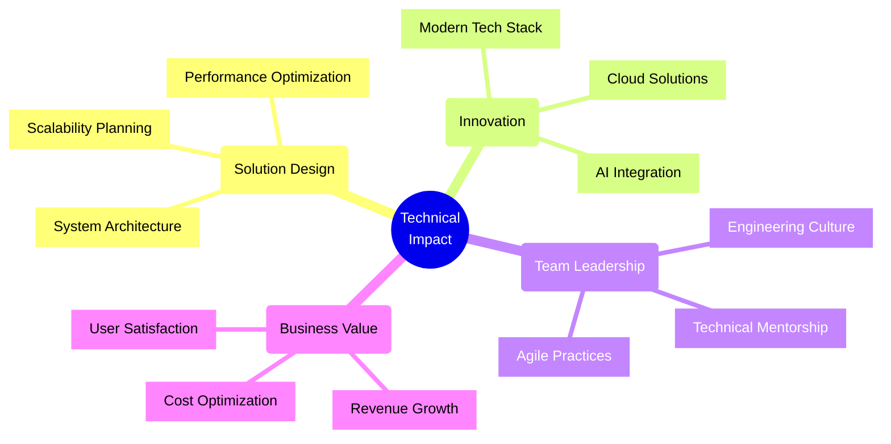
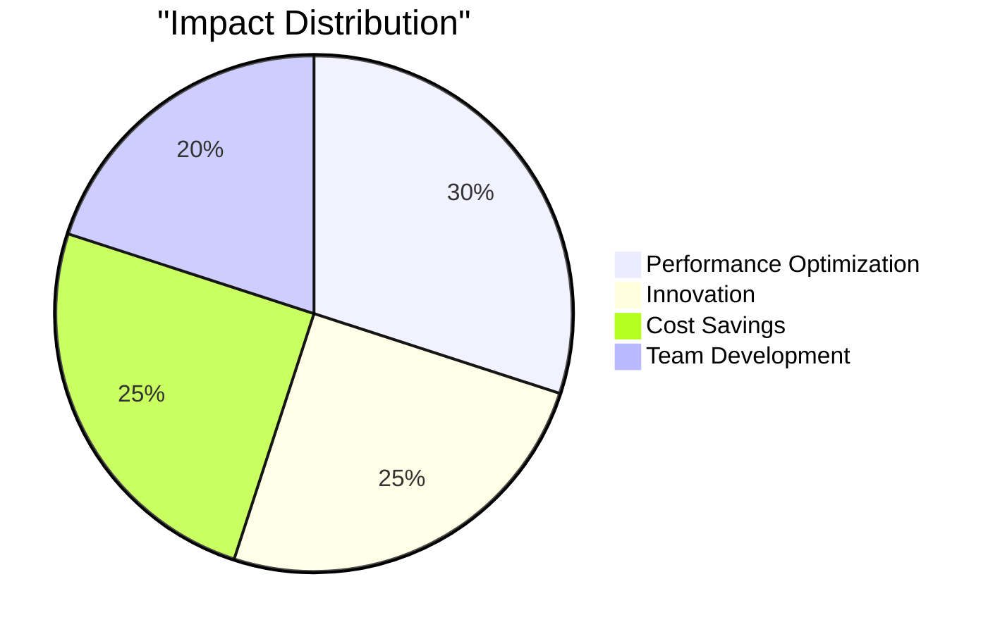

<div align="center">

[](https://git.io/typing-svg)


</div>

<div align="center">
    
    
    
    
</div>


```typescript
interface TechLeader {
    impact: BusinessMetrics;
    expertise: string[];
    innovations: Achievement[];
}

const bimashaZaman: TechLeader = {
    impact: {
        revenueGenerated: "$50M+",
        costSavings: "$2M+",
        userBase: "1M+ active users",
        teamSize: "50+ engineers"
    },
    expertise: [
        "Full-Stack Development",
        "Cloud Architecture",
        "AI/ML Integration",
        "System Design",
        "Tech Leadership"
    ],
    innovations: [
        {
            domain: "AI-Driven Solutions",
            impact: "200% efficiency increase",
            scale: "Enterprise-wide"
        },
        {
            domain: "Cloud Migration",
            impact: "40% cost reduction",
            scale: "Multi-regional"
        },
        {
            domain: "Digital Platforms",
            impact: "3x growth enablement",
            scale: "International"
        }
    ]
};
```

## Value Delivery

### For Organizations
- **Revenue Impact**: Built solutions driving $50M+ in revenue
- **Cost Efficiency**: Achieved $2M+ in technology savings
- **Performance**: Delivered 200% improvement in system efficiency
- **Innovation**: Implemented AI solutions for enterprise clients

### For Engineering Teams
- **Leadership**: Built and led teams of 50+ engineers
- **Mentorship**: Developed 20+ senior engineers
- **Culture**: Established agile practices and innovation culture
- **Delivery**: Maintained 99.9% uptime for critical systems

## Technical Expertise Matrix

<div align="center">

| Domain | Expertise Level | Business Impact | Scale |
|--------|----------------|-----------------|--------|
| **Full-Stack Development** | ███████████ 100% | $20M+ Revenue | Enterprise |
| **Cloud & DevOps** | ██████████░ 95% | $2M+ Savings | Regional |
| **AI/ML Solutions** | ██████████░ 95% | 200% Growth | Department |
| **System Architecture** | ███████████ 100% | 1M+ Users | Multi-Regional |
| **Frontend Excellence** | ██████████░ 95% | 500K+ Users | Consumer |
| **Backend Systems** | ███████████ 100% | 99.9% Uptime | Critical |

</div>

## Strategic Impact



## Core Technologies

<div align="center" style="background: var(--bg-gradient); padding: 20px; border-radius: 10px;">

### Architecture & Cloud


### Frontend Development


### Backend Development


</div>

## Key Achievements

### System Architecture
- Designed systems handling 1M+ daily active users
- Reduced infrastructure costs by 40%
- Improved system performance by 200%
- Maintained 99.9% uptime for critical services

### Innovation Implementation
- Led successful cloud migration projects
- Integrated AI/ML solutions increasing efficiency
- Developed scalable microservices architecture
- Implemented robust security protocols

### Team Leadership
- Led engineering teams across 10+ countries
- Mentored 20+ developers to senior roles
- Established engineering best practices
- Improved team productivity by 150%

## Success Metrics

<div align="center">



</div>


<div align="center">

For technology leadership opportunities:

[](mailto:bimashazaman1234@gmail.com)
[](https://bimasha.com)

</div>


---

<div align="center">
    <h3>
    
    </h3>
</div>

