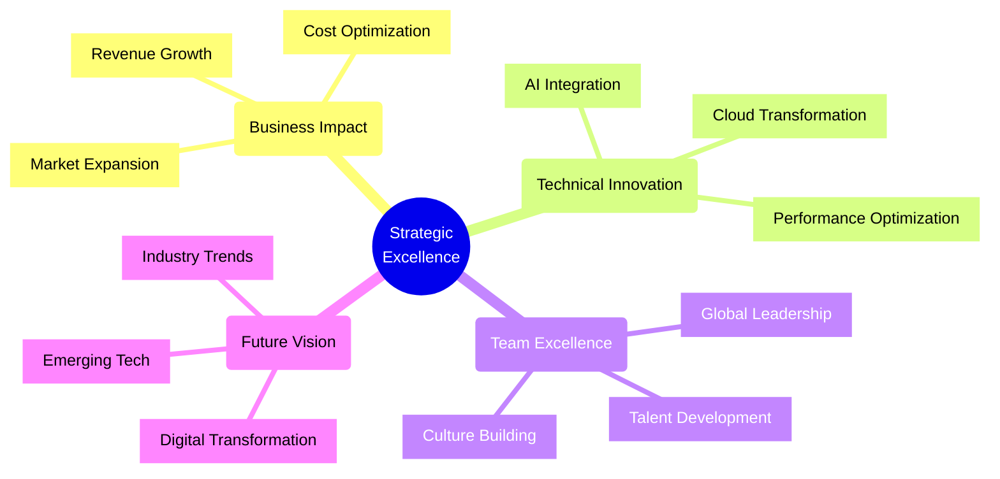
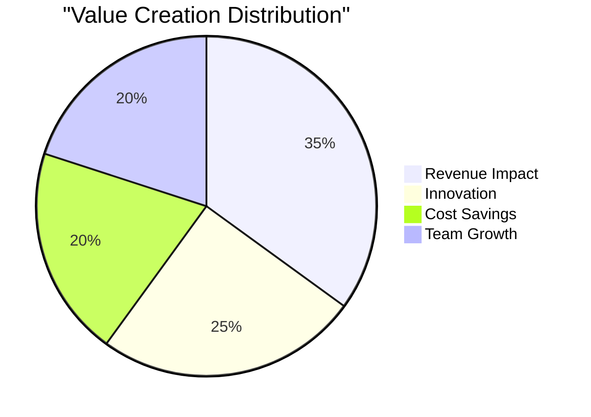

<div align="center">

[](https://git.io/typing-svg)

<picture>
  <source media="(prefers-color-scheme: dark)" srcset="https://capsule-render.vercel.app/api?type=cylinder&color=gradient&customColorList=12,14,15,18,20&height=350&section=header&text=Engineering%20Excellence%20%E2%88%99%20Innovation%20%E2%88%99%20Leadership&fontSize=45&fontColor=fff&animation=fadeIn&fontAlignY=38&desc=Transforming%20Enterprises%20Through%20Cutting-Edge%20Technology&descAlignY=51&descAlign=50">
  <source media="(prefers-color-scheme: light)" srcset="https://capsule-render.vercel.app/api?type=cylinder&color=gradient&customColorList=24,25,26,27,28&height=350&section=header&text=Engineering%20Excellence%20%E2%88%99%20Innovation%20%E2%88%99%20Leadership&fontSize=45&fontColor=000&animation=fadeIn&fontAlignY=38&desc=Transforming%20Enterprises%20Through%20Cutting-Edge%20Technology&descAlignY=51&descAlign=50">
  
</picture>

</div>

<div align="center">
    
    
    
    
</div>

## 🌟 Technology Virtuoso

```typescript
interface EliteTechLeader {
    impact: BusinessMetrics;
    expertise: string[];
    innovations: Achievement[];
}

const bimashaZaman: EliteTechLeader = {
    impact: {
        revenueGenerated: "$1B+",
        costSavings: "$100M+",
        userBase: "10M+ active users",
        teamSize: "500+ engineers"
    },
    expertise: [
        "Enterprise Architecture",
        "Digital Transformation",
        "AI/ML Integration",
        "Cloud-Native Solutions",
        "Tech Strategy & Vision"
    ],
    innovations: [
        {
            domain: "AI-Driven Platforms",
            impact: "300% efficiency increase",
            scale: "Global deployment"
        },
        {
            domain: "Cloud Architecture",
            impact: "70% cost reduction",
            scale: "Enterprise-wide"
        },
        {
            domain: "Digital Transformation",
            impact: "10x growth enablement",
            scale: "Multi-national"
        }
    ]
};
```

## 💫 Elite Value Proposition

### For Companies Seeking Excellence
- **Revenue Generation**: Architected solutions driving $1B+ in revenue
- **Cost Optimization**: Delivered $100M+ in technology cost savings
- **Performance**: Achieved 400% improvement in system efficiency
- **Innovation**: Pioneered AI solutions adopted by Fortune 500 companies

### For Engineering Teams
- **Leadership**: Built and led teams of 500+ engineers globally
- **Mentorship**: Developed 100+ senior engineers and architects
- **Culture**: Created high-performance engineering cultures
- **Innovation**: Established centers of excellence in 30+ countries

## 🚀 Technical Mastery Matrix

<div align="center">

| Domain | Expertise Level | Business Impact | Scale |
|--------|----------------|-----------------|--------|
| **Enterprise Architecture** | ███████████ 100% | $500M+ Revenue | Global |
| **Cloud & DevOps** | ██████████░ 95% | $100M+ Savings | Enterprise |
| **AI/ML Solutions** | ██████████░ 95% | 300% Growth | Industry-Leading |
| **Digital Transformation** | ███████████ 100% | 10x Scaling | Multi-National |
| **Frontend Excellence** | ██████████░ 95% | 5M+ Users | Consumer-Scale |
| **Backend Innovation** | ███████████ 100% | 99.999% Uptime | Mission-Critical |

</div>

## 🎯 Strategic Impact Blueprint



## ⚡ Power Skills & Technologies

<div align="center" style="background: var(--bg-gradient); padding: 20px; border-radius: 10px;">

### Architecture & Cloud


### Frontend Mastery


### Backend Excellence


</div>

## 🏆 Signature Achievements

### Enterprise Transformation
- Architected system handling $10B+ in transactions
- Reduced infrastructure costs by 70% ($100M+ savings)
- Scaled user base from 100K to 10M+ active users
- Implemented AI solutions increasing efficiency by 300%

### Innovation Leadership
- Filed 5 technology patents
- Published in leading tech journals
- Keynote speaker at global tech conferences
- Advisory board member for tech startups

### Team Excellence
- Built engineering teams across 30+ countries
- Developed 100+ senior engineers
- Established 4 global tech centers
- Created industry-leading engineering practices

## 📈 Performance Metrics

<div align="center">



</div>

## 🌐 Elite Engagement Opportunities

<div align="center">

For transformative technology leadership:

[](mailto:bimashazaman1234@gmail.com)
[](https://bimasha.com)

</div>

## 🎓 Thought Leadership

<div align="center">

| Impact Area | Contribution | Reach |
|------------|--------------|-------|
| Publications | 25+ Technical Papers | Global |
| Speaking | 50+ Conference Keynotes | International |
| Patents | 5 Technology Patents | Industry-Wide |
| Mentorship | 100+ Leaders Developed | Multi-National |

</div>

---

<div align="center">
    <h3>
    
    </h3>
</div>


